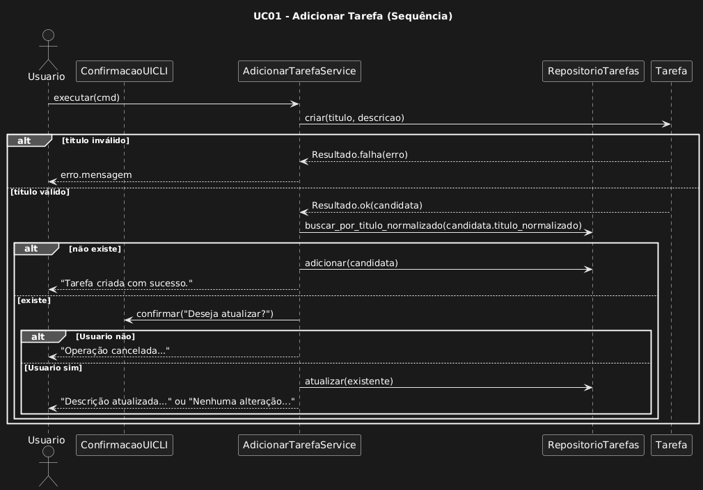

```plantUML

@startuml
title UC01 - Adicionar Tarefa (Sequência)

actor Usuario
participant "ConfirmacaoUICLI" as UI
participant "AdicionarTarefaService" as Service
participant "RepositorioTarefas" as Repo
participant "Tarefa" as Dom

Usuario -> Service: executar(cmd)
Service -> Dom: criar(titulo, descricao)

alt titulo inválido
  Dom --> Service: Resultado.falha(erro)
  Service --> Usuario: erro.mensagem
else titulo válido
  Dom --> Service: Resultado.ok(candidata)
  Service -> Repo: buscar_por_titulo_normalizado(candidata.titulo_normalizado)

  alt não existe
    Service -> Repo: adicionar(candidata)
    Service --> Usuario: "Tarefa criada com sucesso."
  else existe
    Service -> UI: confirmar("Deseja atualizar?")
    alt Usuario não
      Service --> Usuario: "Operação cancelada..."
    else Usuario sim
      Service -> Repo: atualizar(existente)
      Service --> Usuario: "Descrição atualizada..." ou "Nenhuma alteração..."
    end
  end
end

@enduml


```

## Diagrama de sequencia UC01


